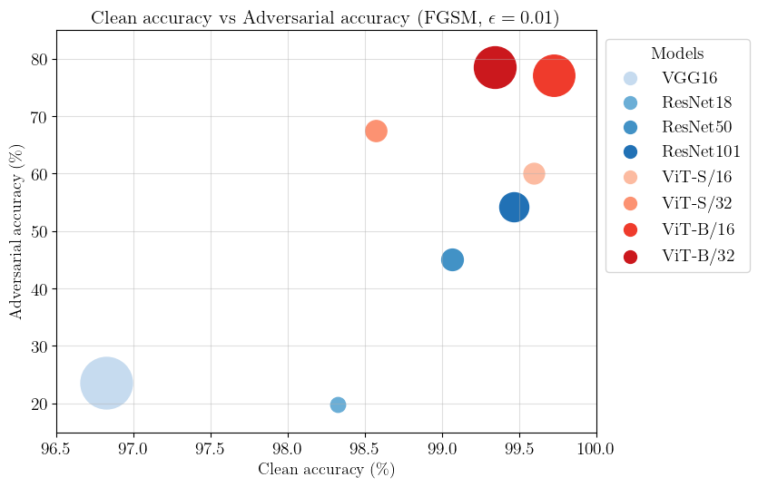

# AdViT

## Adversarial attacks on Vision Transformers (ViTs) and comparison with Convolutional Neural Networks (CNNs)

## Introduction
Vision Transformer (ViT) is a newly proposed [1] architecture for Computer Vision that is turning out to be extremely successful in many different tasks, attaining state-of-art performance on major classification benchmarks, previously dominated by CNN models. It is known that CNN classifiers suffer from adversarial attacks [2], i.e. intentionally designed inputs that cause the model to fail.

Our project will be focused on the study and evaluation of the robustness of ViT to adversarial examples. The first step will be fine-tuning a pretrained ViT on a classification dataset and evaluating adversarial robustness of this model against various attacks, both in a white-box setting and in a black-box setting. We will then compare the results against a CNN baseline both in terms of accuracy on original data (clean accuracy) and accuracy on adversarially modified data (adversarial accuracy) and assess the transferability of attacked images from one architecture to the other, i.e. the possibility of fooling one model by means of an adversarial perturbation produced on a different architecture.

Finally, we will try to increase the robustness of the ViT by performing an adversarial fine-tuning, in which the double aim is maximizing the adversarial accuracy without sacrificing too much the clean accuracy.

Since not many studies ([3], [4]) have been conducted yet on adversarial attacks to ViTs, we are not totally sure of what results will look like. However, we believe that ViTs may turn out to be more robust than CNNs since these models learn less low-level features and they should be less vulnerable to low-level modifications in the input. Regarding transferability of attacks, we expect some positive results with black-box attacks, since they are not based on gradients, while white-box ones may depend too much on the specific model.

### Bibliography

[1] An Image is worth 16x16 words: Transformers for image recognition at scale, Dosovitskiy et al., 2020

[2] Adversarial Attacks and Defenses in Images, Graphs and Text: A Review, Xu et al., 2020

[3] On the Adversarial Robustness of Vision Transformers, Shao et al., 2021

[4] On the Robustness of Vision Transformers to Adversarial Examples, Mahmood et al., 2021

